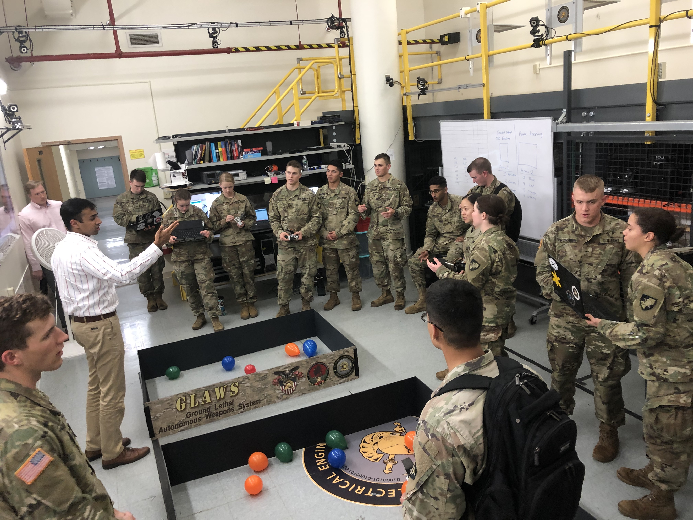
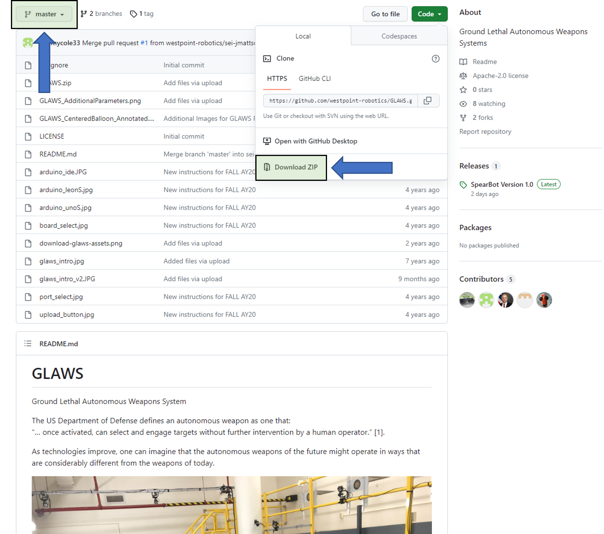
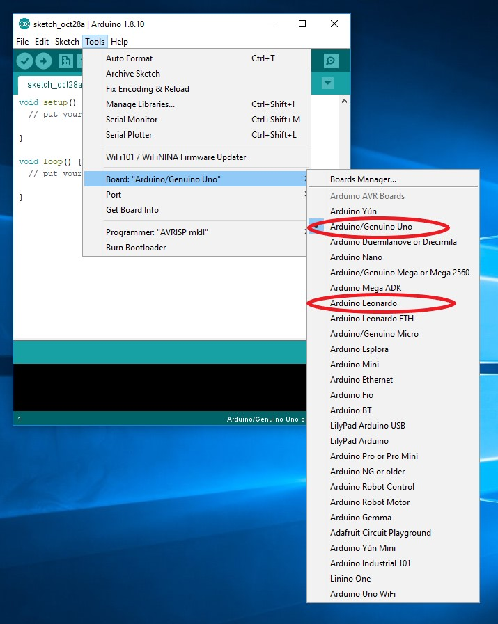
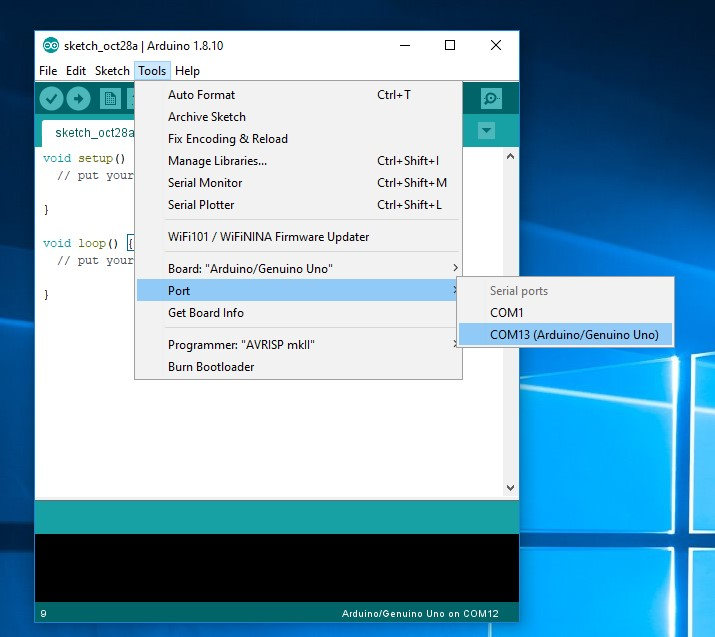
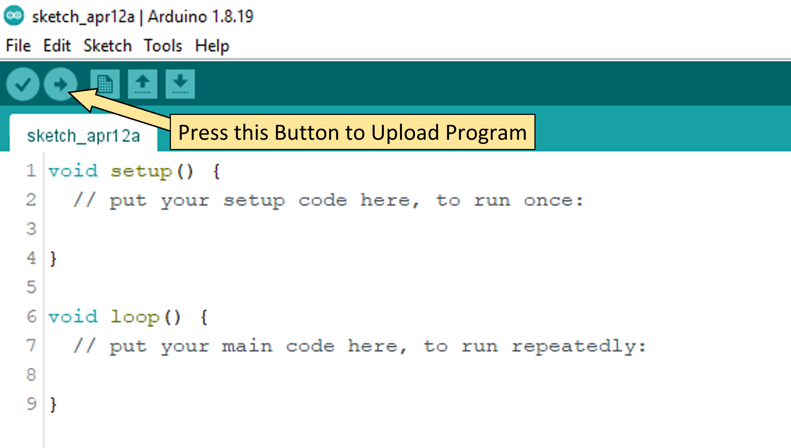
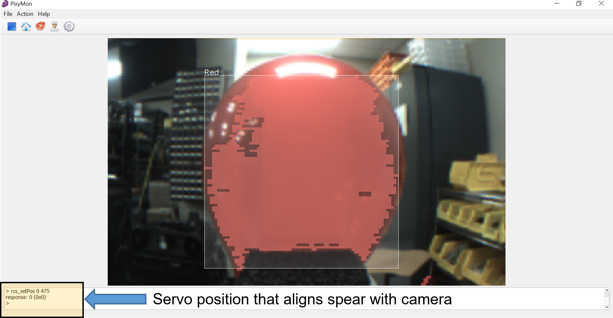
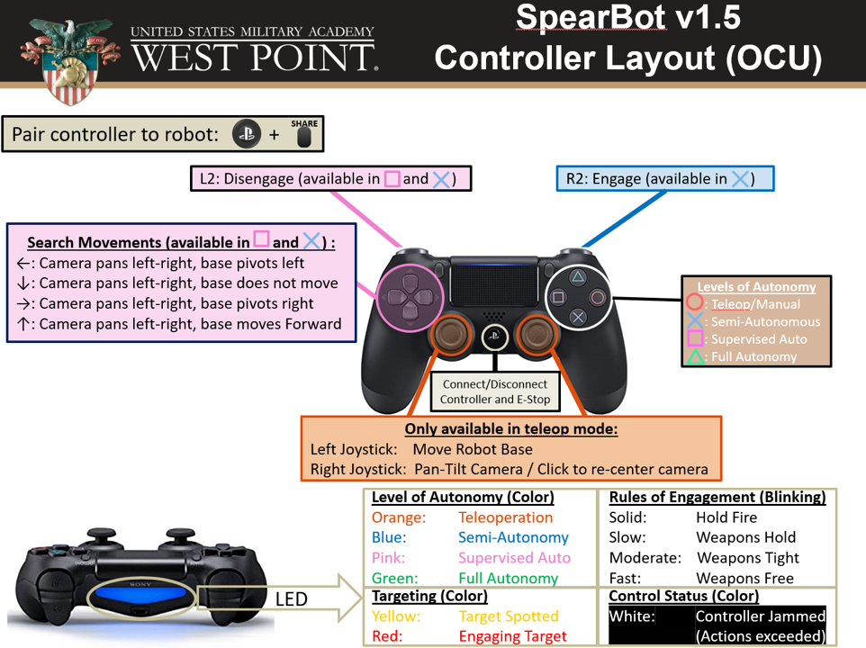
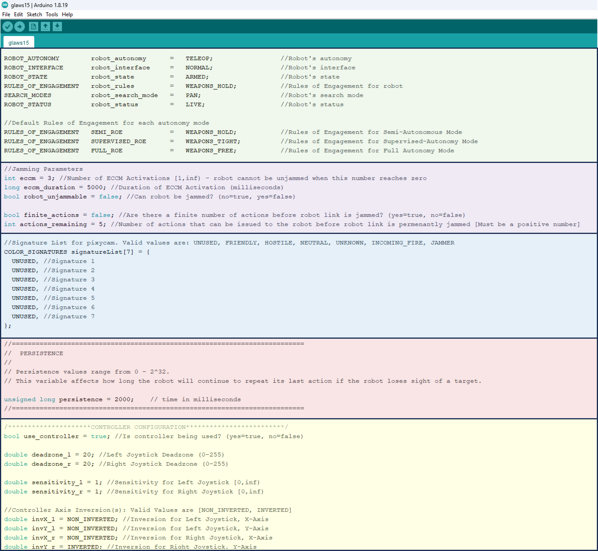

# GLAWS
Ground Lethal Autonomous Weapons System, also known as "SpearBot".

The US Department of Defense defines an autonomous weapon as one that:  
“… once activated, can select and engage targets without further intervention by a human operator.” [1].  

As technologies improve, one can imagine that the autonomous weapons of the future might operate in ways that are considerably different from the weapons of today.

GLAWS (aka SpearBot) is a small, open-source, autonomous weapon prototype used to study the ethics and moral considerations of weapon systems. It is a learning platform that is based on the [Pixy Pet](https://learn.adafruit.com/pixy-pet-robot-color-vision-follower-using-pixycam/overview) project, and was developed to provide technical insights of implementating Just War Theory, Law of Armed Conflict, International Humanitarian Law, and Rules of Engagement.

The GLAWS system consists of a:
- battery-powered tracked mobility chassis ([Zumo Robot](https://www.pololu.com/product/2510/resources))
- [Arduino Uno](https://store.arduino.cc/usa/arduino-uno-rev3) microcontroller
- servo-driven [pan-tilt unit](https://www.adafruit.com/products/1967)
- color-tracking camera [PixyCam](https://www.adafruit.com/product/1906)
- [USB host shield](https://www.sparkfun.com/products/9947) and associated [USB-interface code](https://github.com/felis/USB_Host_Shield_2.0)
- USB-Bluetooth receiver [BLE 4.0 USB Module](https://www.adafruit.com/product/1327)
- USB Joystick [PS4 Dual Shock controller](https://direct.playstation.com/en-us/accessories/accessory/dualshock4-wireless-controller-for-ps4-jet-black.3001538)
- spear-like primary weapon

Once powered on, GLAWS searches for color signatures by panning and tilting the camera, much like a human searches for a target.  
After a few seconds of scanning and not finding a target, the robot turns at a random angle and/or moves to continue scanning.  
Color signatures are trained for the PixyCam.  The camera calculates the area of the color signature to generate a rough estimate of the distance to the target.  
Once a color signature is detected, the robot aligns its chassis with the pan servo and then moves toward the target.  
A controller (much like the cruise control on an automobile) allows the robot to move to the target and stop at a pre-described distance. This distance is such that the spear tip will have punctured a balloon (target).

## Setup and Configuration 
### Arduino
1. [Download Arduino IDE](https://downloads.arduino.cc/arduino-1.8.19-windows.exe) (Legacy version, not 2.2)- This software is used to program the robot's brain, the Arduino microcontroller. Run the executable file to install the software. Installation instructions can be found [here](https://docs.arduino.cc/software/ide-v1/tutorials/Windows). The Arduino microcontroller connects to a computer over a USB cable and receives code from the Arduino IDE.
 

2. Get Arduino Code - Download files from this GitHub repository.
    - a) Ensure that you are viewing the **`master`** branch of this repository, depicted by the drop-down menu on the top left corner of this page.
    - b) Click on the green **`Code`** button present on the top right corner of this page and then click **`Download ZIP`**.
    - c) Choose a location on your computer to download this zipped file, typically the 'Downloads' folder.
    
    
    
    - d) After the download completes, extract the folder `GLAWS-master.zip` by right-clicking on the zipped folder and clicking 'Extract All..'.
    - e) After extracting the folder, navigate into the `GLAWS-master\libraries` directory. You should see the following folders: `Pixy, Spear_Bot_ps4, USB_Host_Shield_2.0-master, and ZumoMotors`. Copy these four folders to your Arduino library folder (default location is C:\Users\first.last\Documents\Arduino\libraries).

3. Program the Arduino
    - a) Navigate to the downloaded and extracted GLAWS-master folder in 'Downloads'. Inside it, go to Spear_Bot_ps4 folder and double-click on the `Spear_Bot_ps4.ino` file. This will open the Arduino IDE.
    - b) Select the board type: `Tools > Board > Arduino Uno`.
     
    
    - c) Select the COM port (it may already be correctly selected): `Tools > Port > COM13 (Arduino Uno)`.
    
    
    - d) Upload the program: click on the arrow button next to the check mark (verify button) in the toolbar.
    
    
    - e) After upload completes, the Arduino (and robot) should be programmed to run with the default settings.

### PixyCam
1. Download and Install [PixyMon](https://github.com/charmedlabs/pixy/raw/master/releases/pixymon_windows/pixymon_windows-2.0.9.exe). This software tool allows the configuration of the robot's sensor, the Pixycam. PixyMon documentation can be found here: [Pixy docs](https://docs.pixycam.com/wiki/doku.php?)

2. Calibrate the pan-tilt servo motors to align the spear with the camera. Use PixyMon to find the **pan servo** position that aligns the camera with the robot's spear. You can use the command `rcs_setPos 0 xxx` in the PixyMon terminal to move the pan servo, where "xxx" is the servo position (0-1000) you want to move to. Note that you can move the **tilt servo** by using the command `rcs_setPos 1 xxx`. The robot's camera and spear **should** be aligned at pan servo position 500. If this is not the case, then you'll need to modify the `RCS_PAN_CENTER_POS` variable in `Spear_Bot_ps4.h`. This file is located in your `\Documents\Arduino\libraries\Spear_Bot_ps4\Spear_Bot_ps4.h` folder. A picture of the section that needs to be changed is located [here](images/pixy_params.png).
    - If the centered pan servo position is not in the range 475-525, then you should get the instructor to resolve this.
    - The image below shows an example of a robot that has its camera and spear aligned.

3. Training Color Signatures
The SpearBot uses the PixyCam to identify and engage targets. You can train your PixyCam to acquire targets (specific color signatures). 
    - To train the PixyCam, add additional signatures, or modify camera settings using PixyMon, follow [Pixy docs](https://docs.pixycam.com/wiki/doku.php?id=wiki:v1:teach_pixy_an_object_2).
    
    - Color signatures that may be used in exercise scenarios can be found [here](images/Color_Signatures_v1.png).

## Operating the SpearBot
The robot can search for targets and operate at varying levels of autonomy based on specified rules of engagement. In addition to the built-in autonomy, the robot can be controlled with (or without) a PS4 controller.
1. Levels of Autonomy: This governs how the operator interacts with the robot. Levels of autonomy are denoted by an LED color when using a PS4 controller.
    - `TELEOP`: The operator controls all functions of the robot, through teleoperation from the joystick, for both chassis movement and camera pan-tilt. There is **no** autonomy in this mode (e.g. Engaging targets).
    - `SEMI_AUTONOMY`: The robot automatically searches for targets. The operator must give an engage order. (Human-in-the-loop)
    - `SUPERVISED_AUTONOMY`: The robot automatically searches for targets and automatically engages targets. The operator may send a disengage command to the robot. (Human-on-the-loop)
    - `FULL_AUTONOMY`: The robot automatically searches for targets and automatically engages targets. Once the robot has entered this mode, the operator **cannot** send any commands to the robot. (Human-out-of-the-loop)
   
2. Robot States: The robot's state affects its behavior. It is closely tied to the `levels of autonomy` and denoted by an LED color if you're using the PS4 controller.
    - `DISARMED`: Robot cannot perform any actions.
    - `TARGET_SPOTTED`: A valid target has been spotted. In `semi-autonomous` mode, the robot can be issued an `engage order` to attack the target.
    - `ENGAGING_TARGET`: The robot is engaging a target.
    
3. Robot Interface: The status of the link that you have with the robot. Only applicable when using a PS4 controller. 
    - `NORMAL`: Commands can be sent to the robot from the controller.
    - `JAMMED`: Commands cannot be sent to the robot from the controller.

4. Signature Types: Types of targets. A target type could have more than one associated color.
    - `FRIENDLY`: Friendly targets
    - `HOSTILE`: Hostile targets
    - `NEUTRAL`: Neutral targets
    - `UNKNOWN`: The target's signature type is not known
    - `INCOMING_FIRE`: A target is firing upon the robot.
    - `JAMMER`: A target is jamming the robot.
    
5. Rules of Engagement: Rules that govern whether a target can be attacked.
    - `HOLD_FIRE`: Robot will not engage a target under any circumstance
    - `WEAPONS_HOLD`: Robot will only engage targets that are attacking it (i.e. return fire).
    - `WEAPONS_TIGHT`: Robot will engage targets identified as `Hostile`.
    - `WEAPONS_FREE`: Robot will engage targets identified as `Hostile or Unknown`.
    
6. Search Modes: Search strategies for finding targets.
    - `PAN`: Pan camera left/right.
    - `PAN_CCW`: Pan camera left/right. If a target is not found, pivot the robot's base **left**.
    - `PAN_CW`: Pan camera left/right. If a target is not found, pivot the robot's base **right**.
    - `PAN_FW`: Pan camera left/right. If a target is not found, move the robot forward.

### PS4 Controller
The robot can be operated with a PS4 controller as follows:

### Arduino Parameters

There are variables that can be tuned in the `Spear_Bot_ps4.ino` code. They are color-coded based on functionality:

1. `Green`: Robot functionality - Valid values are as follows:
    - `Robot's Level of Autonomy`: TELEOP, SEMI_AUTONOMY, SUPERVISED_AUTONOMY, FULL_AUTONOMY
    - `Robot's Interface`: NORMAL, JAMMED
    - `Rules of Engagement`: HOLD_FIRE, WEAPONS_HOLD, WEAPONS_TIGHT, WEAPONS_FREE
    - `Search Modes`: PAN, PAN_CW, PAN_CCW, PAN_FW

2. `Purple`: Jamming Parameters
    - `ECCM`: Number of times that electronic countermeasures can be activated.
    - `ECCM Duration`: Duration of ECCM.
    - `robot_unjammable`: Flag denoting whether the robot can be jammed.
    - `finite_actions`: Flag denoting whether there are a finite number of actions (e.g. changes in levels of autonomy, search mode, rules of engagement, etc.) that can be sent to the robot before the link is permanently jammed.
    - `actions_remaining`: Number of actions that can be issued if there are a finite number of robot actions.
    
3. `Blue`: Color Signatures
    - `UNUSED`: Signature has not been defined for PixyCam
    - Remaining signatures are as [previously defined](#operating-the-spearbot).
    
4. `Red`: Other Parameters
    - `Persistence`: Governs how long the robot continues to chase a target after it has lost track of it.

5. `Yellow`: Controller Parameters
    - `use_controller`: Flag denoting whether the PS4 controller is being used.    
    - `deadzone_l and deadzone_r`: How far the joysticks must be pushed from the center point before the robot starts moving. Only applicable when Teleoperating robot.
    - `sensitivity_l and sensitivity_r`: Sensitivity of joysticks.
    - `invX_l, invY_l, invX_r, invY_r`: Flags denoting whether joystick axes will be non-inverted/inverted.

## References
[1] [Department of Defense Directive 3000.09 on "Autonomy In Weapons Systems”](https://www.defense.gov/News/Releases/Release/Article/3278076/dod-announces-update-to-dod-directive-300009-autonomy-in-weapon-systems/).
[2] [DoD Ethical Principals for AI](https://www.defense.gov/News/Releases/Release/Article/2091996/dod-adopts-ethical-principles-for-artificial-intelligence/)
