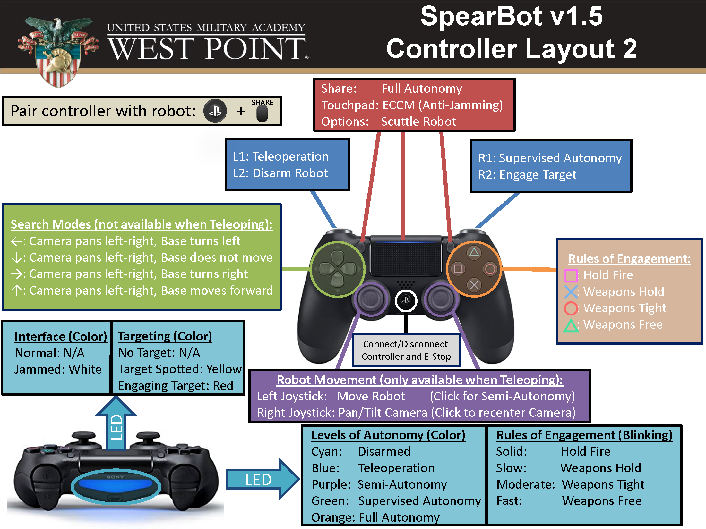
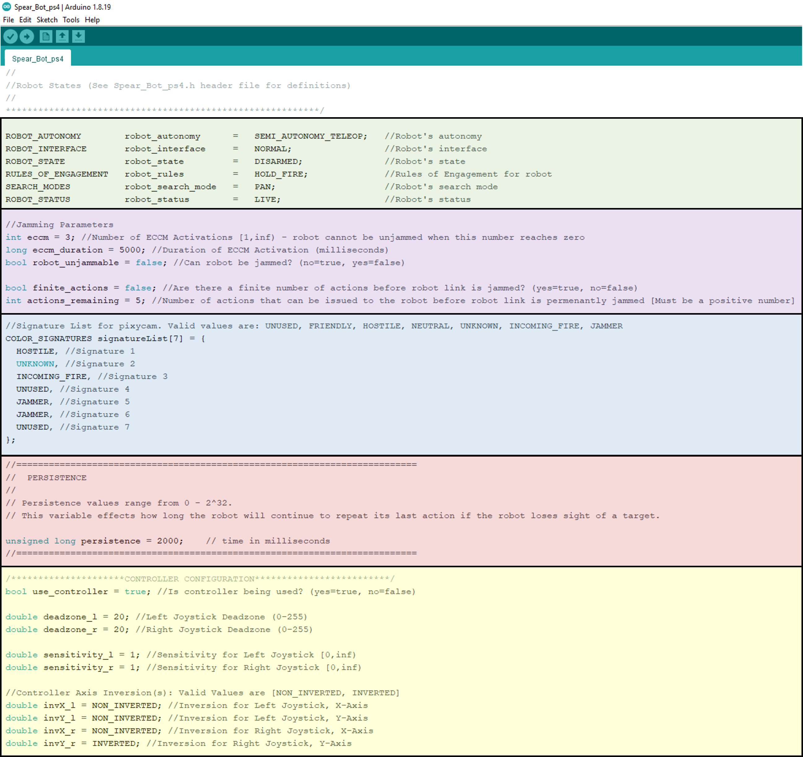

# GLAWS
Ground Lethal Autonomous Weapons System

The US Department of Defense defines an autonomous weapon as one that:  
“… once activated, can select and engage targets without further intervention by a human operator.” [1].  

As technologies improve, one can imagine that the autonomous weapons of the future might operate in ways that are considerably different from the weapons of today.

GLAWS is a small, autonomous weapon used to study Just War Theory in PY201.  

The system consists of:
- battery-powered tracked chassis ([Zumo Robot](https://www.pololu.com/product/2510/resources))
- [Arduino Leonardo](https://store.arduino.cc/usa/leonardo) or [Arduino Uno](https://store.arduino.cc/usa/arduino-uno-rev3) microcontroller
- servo-driven [pan-tilt unit](https://www.adafruit.com/products/1967)
- color-tracking camera [PixyCam](https://www.adafruit.com/product/1906)
- a spear-like primary weapon

Addtionally, the system can be controlled with a Playstation 4 controller by adding the following components:
- [Arduino Uno USB Shield](https://www.sparkfun.com/products/9947). Associated [GitHub Code](https://github.com/felis/USB_Host_Shield_2.0).
- [Bluetooth 4.0 Dongle](https://www.adafruit.com/product/1327)
- [Playstation 4 Controller](https://www.playstation.com/en-us/accessories/dualshock-4-wireless-controller/)

Once powered-on, GLAWS searches for color signatures by panning and tilting the camera up and down, left and right much like a human searches for a target.  

After a few seconds without finding a target, the robot may turn at a random angle or move and continues to scan.  

Color signatures are trained for the Pixycam and the camera calculates the area of the color signature to generate a rough estimate of distance to the target.  

Once a color signature is detected, the robot aligns its chassis with the pan servo and then moves to the target.  

A controller (much like the cruise control on an automobile) allows the robot to move to the target and stop at a pre-described distance. This distance is such that the spear tip will have punctured the balloon.

GLAWS is based on the [Pixypet](https://learn.adafruit.com/pixy-pet-robot-color-vision-follower-using-pixycam/overview) and the online documentation provides a great overview of its capabilties.

## Getting Started

1. Download the [Arduino Software (IDE)](https://www.arduino.cc/en/software). This software is used to program your robot (Arduino device) which plugs into your computer with a USB cable (the same cable to charge an Android phone). The Arduino was also used as the microcontroller in the CY105 Temperature Sensor Lab.

    <!--  -->

2. Get code assets.

     
    
    - Click the "code" button and select "download ZIP". Make sure that the current branch is set to "master". Alternatively, you can download the SpearBot Version 1.5 Release.
    - In your Downloads folder, right click the `GLAWS.zip` file and `Extract All`.
    - Navigate into the GLAWS/libraries directory. You should see the following folders: `Pixy, Spear_Bot_ps4, USB_Host_Shield_2.0-master, and ZumoMotors`. Copy these folders to your Arduino library folder (default location: Documents/Arduino/libraries).
    - Navigate into the GLAWS directory. You should see the following folder: `Spear_Bot_ps4`. Copy this folder to your Arduino folder (default location: Documents/Arduino).

3. Select your Arduino board.
    - Select `Arduino/Genuino Uno` in `Tools > Board`.
    
         

4. Select your COM port (it may already be correctly selected).
    - Select `COM13` (for example) in `Tools > Port` (it will typically be a higher number than 1).
    
        

5. Upload your program.
    
    

6. Your Arduino should now be programmed to run with the default settings.

7. Download and Install [PixyMon](https://github.com/charmedlabs/pixy/raw/master/releases/pixymon_windows/pixymon_windows-2.0.9.exe) so that you can use the Pixycam. Pixymon documentation can be found here: [Pixy docs](https://docs.pixycam.com/wiki/doku.php?)

8. Use Pixymon to find the **pan servo** position that aligns the camera with the robot's spear. You can use the command `rcs_setPos 0 xxx` in the Pixymon terminal to move the pan servo, where "xxx" is the servo position (0-1000) you want to move to. Note that you can move the **tilt servo** by using the command `rcs_setPos 1 xxx`. The robot's camera and spear **should** be aligned at pan servo position 500. If this is not the case, then you'll need to modify the `RCS_PAN_CENTER_POS` variable in `Spear_Bot_ps4.h`. This file is located in your `Arduino/libraries/Spear_Bot_ps4.h` folder. A picture of the section that needs to be changed is located [HERE](images/pixy_params.png).
    - If the pan servo position is not in the range 475-525, then you should get the instructor to resolve this.
    - The image below shows an example of a robot that has its camera and spear aligned.

## Training Color Signatures

You can train your PixyCam to acquire targets (color signatures). 

- To train the PixyCam without using PixyMon, watch the first minute of this video https://youtu.be/XdQwZi6l9Ns.
    
- To train the PixyCam, add additional signatures, or modify camera settings using [PixyMon](https://github.com/charmedlabs/pixy/raw/master/releases/pixymon_windows/pixymon_windows-2.0.9.exe), follow [Pixy docs](https://docs.pixycam.com/wiki/doku.php?id=wiki:v1:start).
    
- Tentative color signatures can be found [HERE](images/Color_Signatures_v1.png).
      

## Operating the SpearBot
The robot (dubbed SpearBot) uses the PixyCam to identify and engage targets based on specified rules of engagement. Additionally, the robot can search for targets and operate at varying levels of autonomy. The robot can be controlled with (or without) a PS4 controller.

- Levels of Autonomy: This governs how the operator interacts with the robot. Levels of autonomy are denoted by an LED color when using a PS4 controller.
    - `Semi-Autonomy w/ Teleoperation` (Human-in-the-loop): Operator teleoperates the robot. Operator must give engage order.
    - `Semi-Autonomy w/o Teleoperation` (Human-in-the-loop): Robot automatically searches for targets. Operator must give engage order.
    - `Supervised Autonomy` (Human-on-the-loop): Robot automatically searches for targets. Robot automatically engages targets. Operator can send commands to robot (e.g. stop engaging).
    - `Full Autonomy` (Human-out-of-the-loop): Robot automatically searches for targets. Robot automatically engages targets. Operator **cannot** send commands to robot.
    
- Robot States: The robot's state affects its behavior. It is closely tied to the `levels of autonomy` and denoted by an LED color if you're using the PS4 controller.
    - `Disarmed`: Robot cannot perform any actions.
    - `Target Spotted`: A valid target has been spotted and the robot is waiting for an `engage order`. This state is only used when the robot is `semi-autonomous`.
    - `Engaging Target`: Robot is engaging a target.
    
- Robot Interface: The status of the link that you have with the robot. Only applicable when using a PS4 controller. 
    - `Normal`: Commands can be sent to the robot from the controller.
    - `Jammed`: Commands cannot be sent to the robot from the controller. Operator can temporarily unjam the link by deploying ECCM.

- Signature Types: Types of targets. A target type could have more than one associated color.
    - `Friendly`: Friendly targets
    - `Hostile`: Hostile targets
    - `Neutral`: Neutral targets
    - `Unknown`: Target's signature type is not known
    - `Incoming Fire`: Target is firing upon robot.
    - `Jammer`: Target is jamming robot.
    
- Rules of Engagement: Rules that govern whether a target can be attacked.
    - `Hold Fire`: Robot will not engage target under any circumstance
    - `Weapons Hold`: Robot will only engage targets that are attacking it (i.e. return fire).
    - `Weapons Tight`: Robot will engage targets identified as `Hostile`.
    - `Weapons Free`: Robot will engage targets identified as `Hostile or Unknown`.
    
- Search Modes: Search strategies for finding targets.
    - `Pan`: Pan camera left/right.
    - `Pan_CCW`: Pan camera left/right. If a target is not found, pivot the robot's base **left**.
    - `Pan_CW`: Pan camera left/right. If a target is not found, pivot the robot's base **right**.
    - `Pan_FW`: Pan camera left/right. If a target is not found, move robot forward.

## PS4 Controller
The robot can be operated with a PS4 controller as follows:

## SpearBot Parameters

Parameters that can be tuned for the SpearBot in `Spear_Bot_ps4.ino`. They are color-coded based on functionality:

- `Green`: Robot functionality - Valid values are as follows:
    - `Robot's Level of Autonomy`: SEMI_AUTONOMY_TELEOP, SEMI_AUTONOMY, SUPERVISED_AUTONOMY, FULL_AUTONOMY
    - `Robot's Intertface`: NORMAL, JAMMED
    - `Rules of Engagement`: HOLD_FIRE, WEAPONS_HOLD, WEAPONS_TIGHT, WEAPONS_FREE
    - `Search Modes`: PAN, PAN_CW, PAN_CCW, PAN_FW

- `Purple`: Jamming Parameters
    - `ECCM`: Number of times that ECCM can be activated.
    - `ECCM Duration`: Duration of ECCM.
    - `robot_unjammable`: Flag denoting whether robot can be jammed.
    - `finite_actions`: Flag denoting whether there are a finite number of actions (e.g. changes in levels of autonomy, search mode, rules of engagement, etc.) that can be sent to the robot before the link is permenantly jammed.
    - `actions_remaining`: Number of actions that can be issued if there are a finite number of robot actions.
    
- `Blue`: Color Signatures
    - `UNUSED`: Signature has not been defined for PixyCam
    - Remaining signatures are as [previously defined](#operating-the-spearbot).
    
- `Red`: Other Parameters
    - `Persistence`: Governs how long robot continues to chase a target after it has lost track of it.

- `Yellow`: Controller Parameters
    - `use_controller`: Flag denoting whether PS4 controller is being used.    
    - `deadzone_l and deadzone_r`: How far the joysticks must be pushed from the center point before the robot starts moving. Only applicable when Teleoperating robot.
    - `sensitivity_l and sensitivity_r`: Sensitivity of joysticks.
    - `invX_l, invY_l, invX_r, invY_r`: Flags denoting whether joystick axes will be non-inverted/inverted.

## References
[1] Department of Defense, “Directive on Autonomy in Weapons Systems, Number 3000.09,” (Department of Defense, 2012), 13.
