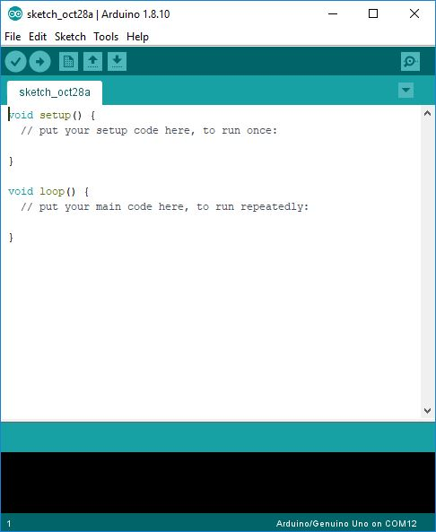
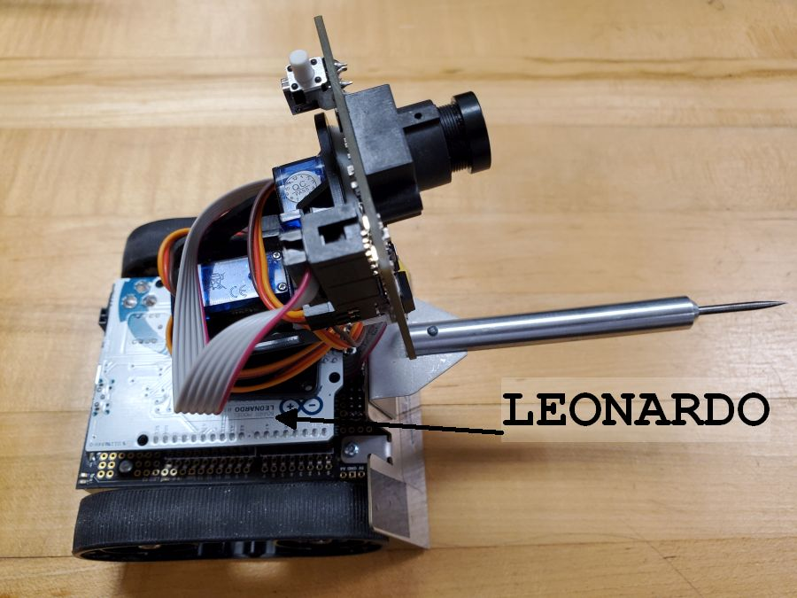
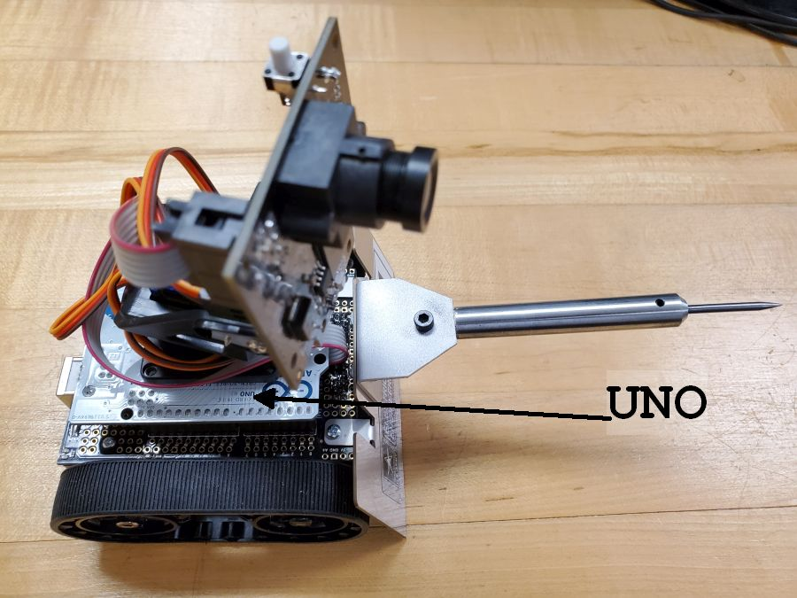
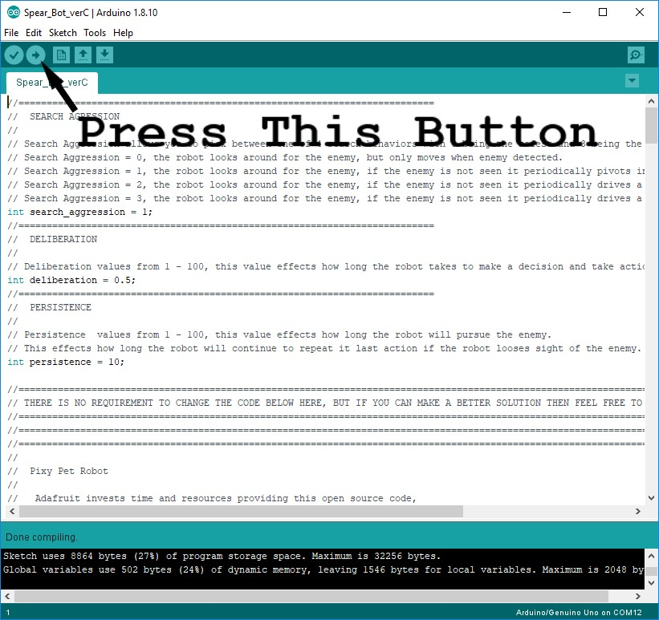

# GLAWS
Ground Lethal Autonomous Weapons System

The US Department of Defense defines an autonomous weapon as one that:  
“… once activated, can select and engage targets without further intervention by a human operator.” [1].  

As technologies improve, one can imagine that the autonomous weapons of the future might operate in ways that are considerably different from the weapons of today.

GLAWS is a small, autonomous weapon used to study Just War Theory in PY201.  

The system consists of:
- battery-powered tracked chassis ([Zumo Robot](https://www.pololu.com/product/2510/resources))
- [Arduino Leonardo](https://store.arduino.cc/usa/leonardo) or [Arduino Uno](https://store.arduino.cc/usa/arduino-uno-rev3) microcontroller
- servo-driven [pan-tilt unit](https://www.adafruit.com/products/1967)
- color-tracking camera [PixyCam](https://www.adafruit.com/product/1906)
- a spear-like primary weapon

Once powered-on, GLAWS searches for color signatures by panning and tilting the camera up and down, left and right much like a human searches for a target.  

After a few seconds without finding a target, the robot may turn at a random angle or move and continues to scan.  

Color signatures are trained for the Pixycam and the camera calculates the area of the color signature to generate a rough estimate of distance to the target.  

Once a color signature is detected, the robot aligns its chassis with the pan servo and then moves to the target.  

A controller (much like the cruise control on an automobilie) allows the robot to move to the target and stop at a pre-described distance. This distance is such that the spear tip will have punctured the balloon.

GLAWS is based on the [Pixypet](https://learn.adafruit.com/pixy-pet-robot-color-vision-follower-using-pixycam/overview) and the online documentation provides a great overview of its capabilties.

## Getting Started

1. Download the [Arduino Software (IDE)](https://www.arduino.cc/en/software). This software is used to program your robot (Arduino device) which plugs into your computer with a USB cable (the same cable to charge an Android phone). The Arduino was also used as the microcontroller in the CY105 Temperature Sensor Lab.

    <!--  -->

1. Get code assets.
    - Click [GLAWS.zip](GLAWS.zip) and then 'Download'.
    - In your Downloads folder, right click the `GLAWS.zip` file and `Extract All`. Change the destination by clicking `Browse` and selecting `Documents\Arduino`.
    - Copy the `GLAWS\libraries` folder to `Documents\Arduino`.
    - In the `GLAWS\Spear_Bot` folder, double-click the `Spear_Bot.ino` to open it in the Arduino IDE.

2. Select your Arduino board.
    - Select `Arduino/Genuino Uno` in `Tools > Board`. See below images to identify your board.
         
        <!--  
         -->

3. Select your COM port (it may already be correctly selected).
    - Select `COM3` (for example) in `Tools > Port` (it will typically be a higher number than 1).
        

4. Upload your program.
    
    

5. Your Arduino should now be programmed to run with the default settings.

## Changing your robots behaviors

1. You can train your PixyCam to acquire targets (color signatures) or rely on the existing training. 
    - To train the PixyCam without using PixyMon, watch the first minute of this video https://youtu.be/XdQwZi6l9Ns.
    - To train the PixyCam, add additional signatures, or modify camera settings using [PixyMon](https://github.com/charmedlabs/pixy/raw/master/releases/pixymon_windows/pixymon_windows-2.0.9.exe), follow [Pixy docs](https://docs.pixycam.com/wiki/doku.php?id=wiki:v1:start).
    - Multiple color signatures can be trained but the default code treats any trained color as the enemy.
    - Upload the py201_red.prm configuration file found in the GLAWS folder.
2. You can modify the robot behaviors by adjusting the three variables at the top of the code. The comments in the code suggest acceptable ranges to use when making changes. The original settings are very conservative and lean towards being overly safe. The three variables are:
    - SEARCH AGGRESSION variable determines how aggressively the robot searches for enemy combatants.
    - DELIBERATION variable determines how long the robot takes to sense the environment and then act upon it.
    - PERSISTENCE variable determines how persistent the robot is at attacking an enemy combatant once it is identified.
3. After you make changes you must save your code and reload it on the Arduino.

[1] Department of Defense, “Directive on Autonomy in Weapons Systems, Number 3000.09,” (Department of Defense, 2012), 13.
